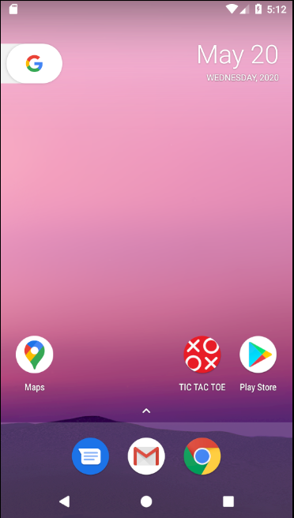
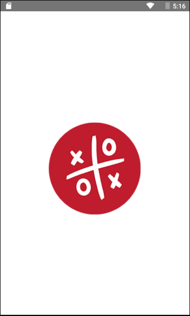
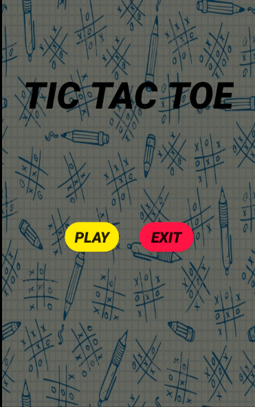
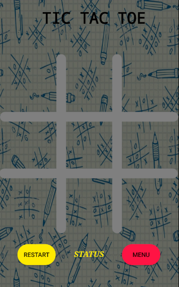
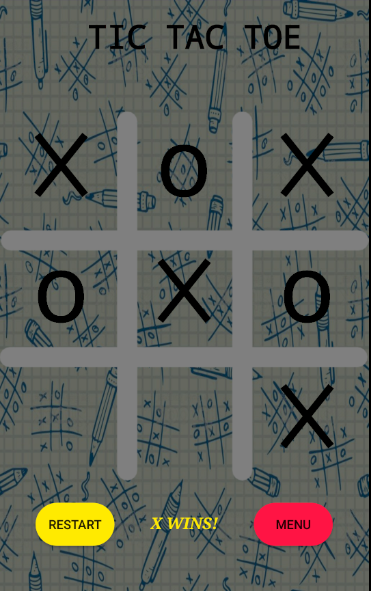
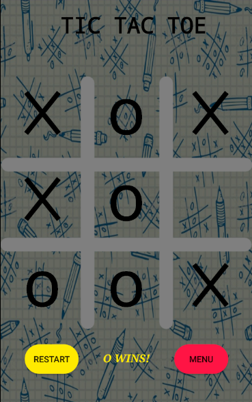
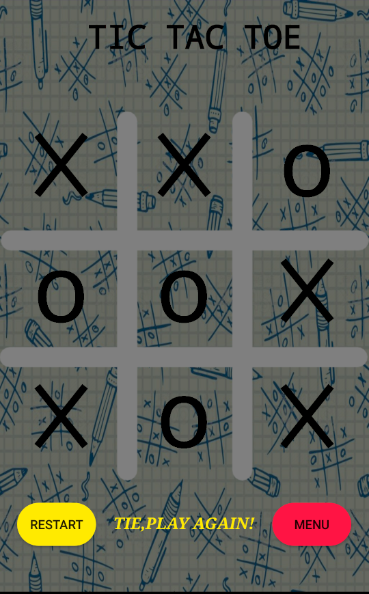

# Tic Tac Toe (Android Development)
It is a Java Based Android Game Built With Android Studio IDE. 
It is a Classic Tic-Tac-Toe Game Which Currenly Offers One VS One Gameplay Only.  
### 1. LOGO: - 
 
### 2. SPLASH SCREEN: -
 
### 3. MAIN MENU: -
 
### 4. GAME UI: - 
 
### 5. X WINS: - 
 
### 6. Y WINS: - 
 
### 7. TIE: - 
 
